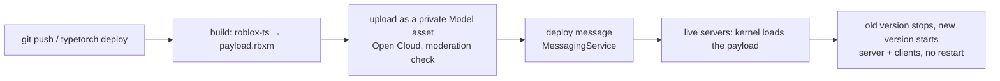

# TypeTorch

**Update live Roblox games without restarting their servers.**

TypeTorch is a roblox-ts framework and toolchain. You push code, CI builds it, and every live server hot-swaps to the new
version in a few seconds. Players stay in the game, their data stays loaded, and nobody gets kicked to a new server.
One place serves any number of branches (`prod`, `dev`, `feature-x`), so you can test a branch in a private server of
the real game instead of keeping a separate testing place.

> **Status: early (0.1.x).** The core loop works on live Roblox servers today. APIs will change.

## Why

Shipping an update on Roblox today means restarting servers. You either kick everyone with "shutdown all servers" or
wait for "migrate to latest update" to drain old servers. Each restart costs players, progress and momentum, so teams
batch changes and ship less often. Testing usually happens in a second "testing place" that drifts from the real one.

TypeTorch treats game code like a deployable artifact instead of part of the place file:
- **No restart for code updates.** Servers load the new version in place.
- **Fast feedback.** From `typetorch deploy` to players running the new build takes about 7–9 seconds.
- **Instant rollback.** Going back to an earlier build re-uses an already-approved upload and takes about 1–2 seconds.
- **Branches in the real game.** Open a private server on any branch with `/tt new <branch>`.
- **Studio becomes optional for code.** Build, test and deploy from the command line or CI, which also suits AI
  agents.

## How it works



1. **Kernel.** A small loader is the only TypeTorch code baked into the place, so it's the only part that needs a
   server restart to change. It chooses each server's branch: public servers run `prod`, and private servers run
   whatever branch they were opened on.
2. **Artifacts.** Each build of your game becomes one immutable artifact, identified by its git commit
   (`prod-a1b2c3d`). It is uploaded as a private Model asset that only your experience can load.
3. **Swaps.** On a deploy message (or a periodic check), each server loads the new artifact next to the running one,
   stops the old version (every connection, thread and instance it created is cleaned up), starts the new one, and
   tells clients to do the same. A version that fails to start is rolled back automatically.
4. **Framework.** Your game code uses modules (`@Service` / `@Controller`) with constructor injection, lifecycle hooks
   and a trove for cleanup. Type-checked networking guards every remote call. The framework ships inside every
   artifact, so framework fixes also hot-swap.
5. **Dev menu.** Developers get an in-game menu with:
   - the running artifact and the server's status;
   - logs and network stats;
   - a client and server explorer;
   - branch switching and rollback;
   - a Claude prompt that edits and redeploys a dev branch.

   Production servers are read-only.

## Repositories

| Repository | Package | What it is |
|---|---|---|
| [**kernel**](https://github.com/typetorch/kernel) | `@typetorch/kernel` | The Luau loader baked into the place: boot, branch selection, artifact loading, hot swaps with automatic rollback, the stable remotes and the `/tt` chat commands |
| [**framework**](https://github.com/typetorch/framework) | `@typetorch/framework` | The roblox-ts framework your game is written with: modules with dependency injection and lifecycle hooks, troves, guarded networking, UI helpers and the in-game dev menu. Ships inside every artifact |
| [**cli**](https://github.com/typetorch/cli) | `@typetorch/cli` | The `typetorch` command (Bun): `build`, `deploy`, `rollback`, `deployments`, `branch ls`, `kernel deploy`, `doctor` |
| [**transformer**](https://github.com/typetorch/transformer) | `@typetorch/transformer` | The roblox-ts compiler plugin that generates runtime type guards and dependency-injection metadata from your types. A stripped-down fork of [rbxts-transformer-flamework](https://github.com/rbxts-flamework/transformer) (MIT) |
| [**template**](https://github.com/typetorch/template) | | A starter game showing every feature: services, controllers, networking, state that survives swaps, and the dev menu |
| [**dev-server**](https://github.com/typetorch/dev-server) | `@typetorch/dev-server` | `remote-claude`: a local server behind a temporary Cloudflare tunnel that lets allowlisted developers prompt Claude Code from inside a dev-branch game server. Claude edits the branch, then the server commits and redeploys it |

## A taste

```ts
// src/shared/net.ts: one typed declaration; guards are generated for every client → server call
interface ClientToServer { coins: { collect(coinId: string): void } }
interface ServerToClient { coins: { changed(total: number): void } }
export const network = createNetwork<ClientToServer, ServerToClient>();

// src/server/services/coin.service.ts
@Service()
export class CoinService extends Module implements OnStart {
	constructor(private readonly score: ScoreService) { super(); } // injected

	onStart() {
		// Handlers live in this module's trove, so a hot swap removes them cleanly.
		this.trove.add(network.server.coins.collect.on((player, coinId) => {
			const total = this.score.add(player, 1);
			network.server.coins.changed.fire(player, total);
		}));
	}
}
```

```bash
typetorch deploy --branch dev      # build, upload, swap every dev server
typetorch rollback --branch dev    # back to the previous build in ~1–2 s
typetorch deployments              # every deploy with its git commit
```

## Principles

- **Everything is identified by git.** Artifact ids, asset descriptions and deployment logs all carry the commit, so
  any build on any server can be traced back to source.
- **Production is read-only.** Public servers always run `prod`, editing tools only work on dev-channel branches, and
  every permission is checked on the server.
- **Clean up everything.** Each module's trove owns what it creates, and a swap leaves nothing behind (tested over
  180 consecutive swaps).

## License

MIT. The transformer keeps the original MIT license of
[rbxts-transformer-flamework](https://github.com/rbxts-flamework/transformer), whose design TypeTorch builds on.
